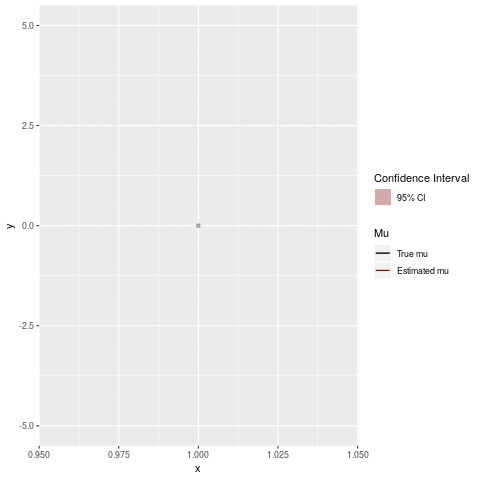

# State Space Demo

This repo contains scripts for exploring hidden markov models (HMM) and kalman filters (KF).

## Kalman Filter

kalmanfilter.R demos using a kalman filter to filter a noisy sine wave. The signal in this case is the position along the y axis. 

## HMM

hmm.R demos using a hidden markov model to detect a different drift regimes, as well as different noise regimes in brownian motion.

**drift shift**

**variance shift**

